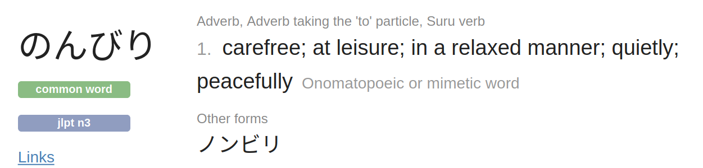

# purescript-nonbili-postgres

[](https://pursuit.purescript.org/packages/purescript-nonbili-postgres)

A nonbili purescript binding to [pg](https://www.npmjs.com/package/pg), called `node-postgres`.

## Example

`test/Main.purs` is generated from this README by `codegen.sh`.

First some imports, `Nonbili.Postgres` is enough for most common cases. `Pool.end` is used in this script to terminate the process.

```purescript
module Test.Main where

import Prelude

import Data.Either (Either(..))
import Data.Tuple.Nested ((/\))
import Effect (Effect)
import Effect.Aff as Aff
import Effect.Class.Console (logShow)
import Nonbili.Postgres as Pg
import Nonbili.Postgres.Pool as Pool
```

In this example, I will create a `post` table, insert a record to it then query for the record.

```purescript
type Post =
  { title :: String
  , private :: Boolean
  }

post1 :: Post
post1 =
  { title: "t1"
  , private: true
  }
```

`Pg.newPool` creates a connection pool from config. All config fields are optional, since `pg` will read `PGHOST`, `PGUSER`, `PGPASSWORD`, `PGDATABASE` environement variables. `Pg.defaultConfig` sets all config fields to Nothing, user can set any field they want.

`withTransaction` acquires a client from the pool, then run queries as a transaction.

```purescript
main :: Effect Unit
main = do
  pool <- Pg.newPool Pg.defaultConfig
  Aff.launchAff_ do
    Pg.withTransaction pool \client -> do
```

`Pg.execute` is the same as `Pg.query`, but ignores all return values. The following code creates a post table, then insert `post1` into it.

```purescript
      Pg.execute client """
        CREATE TEMPORARY TABLE post (
          id int NOT NULL PRIMARY KEY,
          title text NOT NULL,
          private bool NOT NULL,
          created TIMESTAMP WITH TIME ZONE NOT NULL DEFAULT CURRENT_TIMESTAMP
        )
        """ unit
      Pg.execute client "INSERT INTO post VALUES ($1, $2, $3)"
        (1 /\ post1.title /\ post1.private)
```

Let's take a look at the type signature of `query`

```
query :: ToQueryParams p => DecodeJson a => Client -> String -> p -> Aff (Result a)
```

The second argument is a query string, with optional parameter holes to be filled by the third argument `p`. `p` must be an instance of `ToQueryParams`, there are three cases of p:

- no param: `unit`
- array of arguments with the same type: `[a]`
- array of arguments with different types: `a /\ b /\ c /\ d`

`/\` is from [Data.Tuple.Nested](https://pursuit.purescript.org/packages/purescript-tuples/docs/Data.Tuple.Nested#v:(/\)) module.

`encodeJson` is used to convert params to `Json` before sending through FFI to `pg`.

```purescript
      Pg.query client "SELECT * FROM post" unit >>= case _ of
        Left err -> Aff.throwError $ Aff.error err
        Right res -> logShow $ res.rows == [post1]
    Pool.end pool
```

The return value of `query` is `Aff (Result a)`, which is equivalent to `Aff (Either String { rows :: Array a, rowCount :: Int })`. The `Either String` part is because we use `decodeJson` to parse `pg` rows to `Array a`. The `rowCount` can be useful to find out how many rows are affected when using `DELETE` or `UPDATE`.

Because `encodeJson` and `decodeJson` are used, user of this library don't need to deal with `Foreign`.

## Run the test

```
createdb nonbili_pg
PGDATABASE=nonbili_pg spago test
```

## Support me

Nonbili is written as のんびり in Japanese, according to jisho.org, it means



You can support my open source works by hiring me, or using [Hunch](https://hunch.cloud). Hunch is a website builder written in Haskell and PureScript.

This library follows [purescript-ffi-best-practices](https://github.com/nonbili/purescript-ffi-best-practices).
